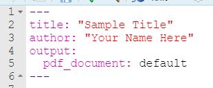

## Welcome to the EMT-Learns-R Page
I will keep this page updated with our bi-weekly code files and recordings, practice exercises, and other resources. If you want to set up email alerts for updates/additions to this site, you can use the free version of a third-party program: [Distill](https://distill.io/). The free version will check for updates every six hours and send you alerts. Note: this is a third-party site and you should review their data privacy and security practices before deciding to download.

### General R Resources
- Instructions for installing/updating R and Rstudio can be found [here](./Downloading Installing Updating R and RStudio.pdf).
- [Here](./Intro to R_final.pptx) is a slide deck with helpful information for navigating and setting up R, knitting in R Markdown, and general troubleshooting tips.

### Weekly Session .Rmd Files and Knit Notes
1. [see recording below; no notes provided]
2. [Session 2 (11/8/21) .Rmd File](./Session 2 Notes.Rmd), [Session 2 Knit Notes](./Session-2-Notes.pdf), [college dataset](./college.Rdata)
3. [Session 3 (11/22/21) .Rmd File](./Session 3 Notes.Rmd), [Session 3 Knit Notes](./Session-3-Notes.pdf)
4. [Session 4 (12/6/21) .Rmd File](./Session 4 Notes.Rmd), [Session 4 Knit Notes](./Session-4-Notes.pdf)

### Meeting Recordings
1. [Session 1 (10/25/21): What are R, Rstudio, and RMarkdown?](https://us02web.zoom.us/rec/share/ouXW6BEqyR7O7-jd6hNhmg7aoaH2LxzhAkhr4bdq_TCd6P7sRzjlKBgeHeVqYAjf.DwEPL-ZgI_1oKyyx) (passcode: @hszg4*r)
2. [Session 2 (11/8/21): More on RMarkdown (working directory/etc.), reading in data, intro to plotting using ggplot, knitting](https://us02web.zoom.us/rec/share/-MQsEJHGdqYbut-v41xFGlw5gXl9Gc2WsJOrBiihRUFDk-4SD6k0wuWUe7w7JEnc.24ZixORrfVB4ffsL) (passcode: Tj#+b3Qi) 
3. [Session 3 (11/22/21): Tidying Data](https://us02web.zoom.us/rec/share/jOARzCSWeYesgDv9jEftBuNaICYs0JX72lCh3kQbE5EE_g-brUgTPuYTi1P_y2Zn.BGEEBCyzTsbvSVqB) (passcode: m$uw32sm) 
4. [Session 4 (12/6/21): Practicing with our own data](https://us02web.zoom.us/rec/share/nih7dM77aAxH6r2NJ-q7xW5z1x3EBFMeeqT5ZMwjOvSiJd9QPr7V8_RGvf7qJyaw.0pm32a8Wf9alV_EU) (passcode: 3XW1U2+.)

### Exercises
Please upload all exercises by their due date whenever possible (before the R session begins that day). You should upload your completed file(s) to the folder here: M:\Professional Development\EMT Learns R\Exercises. Name files as follows: "Exercise # - First Name Last Name." 

[Exercise 1 pdf](./Exercise-1.pdf) |  due 11/8/21 
[Exercise 2 pdf](./Exercise-2.pdf), [Exercise 2 .Rmd starter](./Exercise 2.Rmd) | due 11/22/21 
[Exercise 3 pdf](./Exercise-3.pdf), [Exercise 3 .Rmd starter](./Exercise 3.Rmd) | due 12/6/21 

### YAML header
When you download an .Rmd file from this site, the YAML header will be removed (for some reason). Here is a sample header that you can reference when adding your header at the top of your .Rmd file. Note, your header MUST begin on line 1 of your .Rmd file and the formatting must stay consistent in order for it to work (e.g., must begin with three dashes and end with three dashes).

